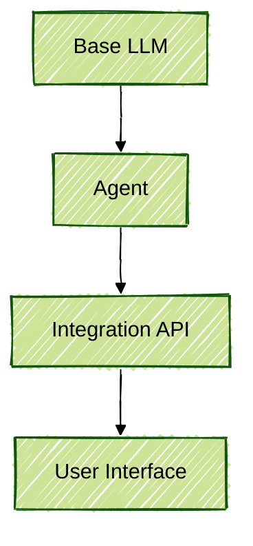

# Mermaid Styling Guide (Updated)

This guide provides a comprehensive overview of how to configure the look and styling of Mermaid diagrams. It includes examples and references to all available styling options, including `classDef`, layout direction, diagram-wide themes, looks, and visual effect approximations.

---

## ✅ Example Diagram with Custom Styling


---

## 📘 Multiple Examples Demonstrating Styling Options

### 🎨 `classDef` with Layout Direction and Font Styling


### 🖍 `handDrawn` Look with Theme


### 🎯 Direct Node Styling with `style`


### ⚙️ Custom Theme Variables with Base Theme


### 🧊 Simulated Glassmorphism Effect

> While Mermaid doesn’t support real `backdrop-filter` effects, this approximation uses transparent fills and light strokes to emulate the feel of glass.

---

## 🎨 Styling with `classDef`

The `classDef` directive allows you to define reusable CSS-like styles.

### Common Attributes:
| Attribute       | Description                                        |
|----------------|----------------------------------------------------|
| `fill`         | Background color                                   |
| `stroke`       | Border color                                       |
| `stroke-width` | Border thickness                                   |
| `color`        | Font color                                         |
| `rx`, `ry`     | Border radius (rounded corners)                   |
| `font-size`    | Font size (e.g., `14px`)                           |
| `font-family`  | Font (e.g., `monospace`, `Arial`)                  |
| `font-weight`  | Text weight (`normal`, `bold`)                     |
| `padding`      | Internal padding                                   |
| `text-align`   | Text alignment (`left`, `center`, `right`)         |

Apply styles using:
```mermaid
classDef myStyle fill:#ccc,stroke:#333,color:black
class MyNode myStyle
```

### Direct Node Styling with `style`

You can apply styles directly to individual nodes:
```mermaid
style MyNode fill:#f9f,stroke:#333,stroke-width:4px
```
> Note: Only SVG-compatible CSS properties are supported. Some properties like `font-size` may not apply with `style`.

---

## 🔄 Layout Direction

Mermaid supports multiple layout directions:

```mermaid
graph TD    %% Top down
```

Options:
- `TD` or `TB`: Top-down (default)
- `LR`: Left to right
- `RL`: Right to left
- `BT`: Bottom to top

---

## 🎭 Themes & Looks

### Themes

Use `theme` to apply preset color and style schemes:
- `default`
- `neutral`
- `dark`
- `forest`
- `base`

Apply via:
```mermaid
%%{ init: { 'theme': 'forest' } }%%
```

### Looks

Looks apply a visual style to diagrams:
- `neo`: Modern
- `handDrawn`: Sketch-like (fun, informal)
- `classic`: Traditional appearance

Applied using frontmatter (works for flowcharts and state diagrams):
```mermaid
---
config:
  look: handDrawn
  theme: forest
---
```

### Theme Variables

For more granular control (especially with `base` theme):
```mermaid
---
config:
  theme: base
  themeVariables:
    primaryColor: "#ff0000"
    primaryTextColor: "#ffffff"
    lineColor: "#00ff00"
    fontFamily: "Arial"
    fontSize: "16px"
---
```

---

## 🧪 Debugging Tips
- Use the [Mermaid Live Editor](https://mermaid.live) for real-time preview.
- In VS Code, install **Markdown Preview Mermaid Support** for live previews.
- For complex styles, inspect SVG elements in browser dev tools.

---

## ✅ Best Practices
- **Consistency**: Use `classDef` to style node types.
- **Readability**: Choose clear layout directions.
- **Customization**: Use themes and `look` for branding.
- **Maintainability**: Use frontmatter for full config control.

---

For more, visit the [Mermaid Official Docs](https://mermaid.js.org/).

