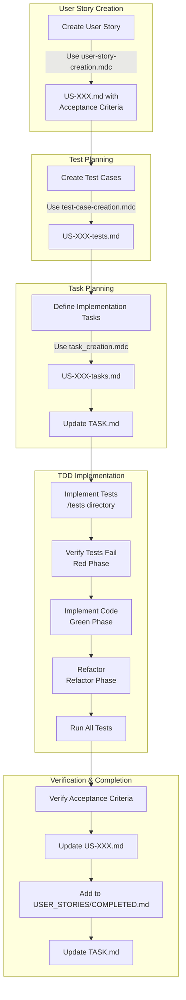

# Test-Driven Development Workflow

This document outlines our test-driven development workflow based on user stories and acceptance criteria.

## Complete Workflow
0. **INITIALIZATION** **NOT TO BE REPEATED**
   - This runs once at the first start of the development
   - Check INITIALIZATION.md to see if initialization is already completed
   - If not completed:
     - Read PLANNING.md to understand project architecture and requirements
     - Setup project structure, npm packages, testing environment based on PLANNING.md
     - Create required configuration files (.eslintrc, tsconfig.json, etc.)
     - Update INITIALIZATION.md to mark initialization as complete
   - If already completed:
     - Skip to step 1
1. **Create User Story**
   - Use the `.cursor/rules/user-story-creation.mdc` format to create a new user story
   - Define clear, testable acceptance criteria using the Given/When/Then format
   - Save as US-XXX.md in a new directory named US-XXX-feature-name

2. **Generate Test Cases**
   - Create US-XXX-tests.md based on `.cursor/rules/test-case-creation.mdc` format
   - Map each test case to specific acceptance criteria
   - Define unit tests, edge cases, and failure cases
   - Consider integration tests for cross-component functionality
   - Include UI component tests for frontend features

3. **Define Implementation Tasks**
   - Create US-XXX-tasks.md based on `.cursor/rules/task_creation.mdc` format
   - Break down implementation into specific, actionable tasks
   - Map tasks to test cases and acceptance criteria
   - Add tasks to the main TASK.md file

4. **Implement Tests**
   - Create actual test files in the /tests directory based on the test cases
   - Ensure tests fail initially (red phase of TDD)

5. **Implement Code**
   - Work through tasks in TASK.md
   - Implement code to make tests pass (green phase of TDD)
   - Refactor code while keeping tests green (refactor phase of TDD)

6. **Verify Acceptance Criteria**
   - Check off acceptance criteria as they are met
   - Run all tests to ensure they pass
   - Conduct any manual verification needed

7. **Close User Story**
   - Update US-XXX.md to mark all acceptance criteria as complete
   - Add the user story to COMPLETED.md
   - Update TASK.md to mark tasks as complete

8. **REPEAT**


## Using with Design System

For UI components:
- Include references to design system documentation in the user story
- Ensure test cases verify design system compliance (tokens, patterns, etc.)
- Reference specific design system components in implementation tasks

## File Organization

The MDC rules (.cursor/rules/*.mdc files) guide both WHERE to create files and WHAT content format to use:

- **User Stories**: Created in `USER_STORIES/US-XXX-feature-name/US-XXX.md` using the `.cursor/rules/user-story-creation.mdc` format
- **Tests**: Implemented in the `/tests` directory (mirroring application structure) following the `.cursor/rules/test-case-creation.mdc` format
- **Tasks**: Added to main `TASK.md` file, organized by workflow phase, using the `.cursor/rules/task_creation.mdc` format

```bash
# Run tests
npm test

# Run specific test
npm test -- -t "test name"
```

# TDD Workflow and Document Structure


