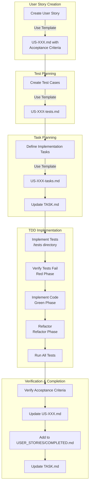

ok. # Test-Driven Development Workflow

This document outlines our test-driven development workflow based on user stories and acceptance criteria.

## Complete Workflow

1. **Create User Story**
   - Use the TEMPLATE.md to create a new user story in the USER_STORIES directory
   - Define clear, testable acceptance criteria using the Given/When/Then format
   - Save as US-XXX.md in a new directory named US-XXX-feature-name

2. **Generate Test Cases**
   - Create US-XXX-tests.md based on TEST_TEMPLATE.md
   - Map each test case to specific acceptance criteria
   - Define unit tests, edge cases, and failure cases
   - Consider integration tests for cross-component functionality
   - Include UI component tests for frontend features

3. **Define Implementation Tasks**
   - Create US-XXX-tasks.md based on TASK_TEMPLATE.md
   - Break down implementation into specific, actionable tasks
   - Map tasks to test cases and acceptance criteria
   - Add tasks to the main TASK.md file

4. **Implement Tests**
   - Create actual test files in the /tests directory based on the test cases
   - Ensure tests fail initially (red phase of TDD)

5. **Implement Code**
   - Work through tasks in TASK.md
   - Implement code to make tests pass (green phase of TDD)
   - Refactor code while keeping tests green (refactor phase of TDD)

6. **Verify Acceptance Criteria**
   - Check off acceptance criteria as they are met
   - Run all tests to ensure they pass
   - Conduct any manual verification needed

7. **Close User Story**
   - Update US-XXX.md to mark all acceptance criteria as complete
   - Add the user story to COMPLETED.md
   - Update TASK.md to mark tasks as complete

8. **REPEAT**


## Using with Design System

For UI components:
- Include references to design system documentation in the user story
- Ensure test cases verify design system compliance (tokens, patterns, etc.)
- Reference specific design system components in implementation tasks

## Sample Commands

```bash
# Create directory for new user story
mkdir -p USER_STORIES/US-XXX-feature-name

# Copy templates
cp USER_STORIES/TEMPLATE.md USER_STORIES/US-XXX-feature-name/US-XXX.md
cp USER_STORIES/TEST_TEMPLATE.md USER_STORIES/US-XXX-feature-name/US-XXX-tests.md
cp USER_STORIES/TASK_TEMPLATE.md USER_STORIES/US-XXX-feature-name/US-XXX-tasks.md

# Run tests
npm test

# Run specific test
npm test -- -t "test name"
```

# TDD Workflow and Document Structure



## Document Structure

```
Project/
├── PLANNING.md                    # Project vision, architecture, standards
├── WORKFLOW.md                    # This TDD workflow guide
├── WORKFLOW_TRACKING.md           # High-level tracking of active story phases
├── TASK.md                        # Current tasks organized by user story & phase
├── USER_STORIES/                  # User story documentation
│   ├── README.md                  # Overview (Optional)
│   ├── TEMPLATE.md                # User story template
│   ├── TEST_TEMPLATE.md           # Test cases template
│   ├── TASK_TEMPLATE.md           # Implementation tasks template
│   ├── COMPLETED.md               # Tracking completed stories
│   └── US-XXX-feature-name/       # Specific user story folder
│       ├── US-XXX.md              # User story with acceptance criteria
│       ├── US-XXX-tests.md        # Test cases for this story
│       └── US-XXX-tasks.md        # Implementation tasks
│
├── TESTS/                         # Actual test implementations
│   ├── README.md                  # Testing guidelines (Optional)
│   ├── components/                # Tests mirror application structure
│   │   └── ...
│   ├── services/
│   │   └── ...
│   └── utils/
│       └── ...
│
├── DESIGN_SYSTEM/                 # Design system for UI components (if applicable)
│   ├── components/
│   ├── documentation/
│   └── tokens/
│
└── .cursor/rules/                 # Cursor MDC rules
    ├── design_system_components.mdc
    ├── tdd_workflow.mdc
    └── ... other rules
```

## TDD Cycle Visualization

```
┌─────────────────────────────────────────────────┐
│                                                 │
│  ┌─────────┐         ┌─────────┐         ┌─────────┐
│  │         │         │         │         │         │
│  │   RED   │ ──────► │  GREEN  │ ──────► │ REFACTOR│
│  │         │         │         │         │         │
│  └─────────┘         └─────────┘         └─────────┘
│      ▲                                        │
│      │                                        │
│      └────────────────────────────────────────┘
│                                                 │
└─────────────────────────────────────────────────┘

  RED      - Write failing tests that validate acceptance criteria
  GREEN    - Implement minimum code to make tests pass
  REFACTOR - Improve code while keeping tests passing
```
